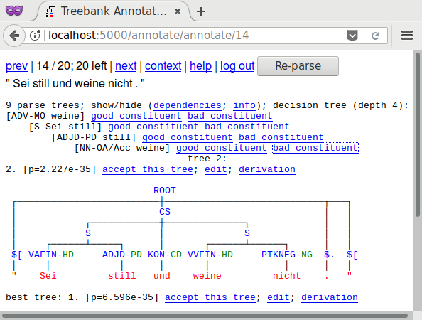

Active DOP treebank annotation tool
===================================

A treebank annotation tool based on a statistical parser that is re-trained during annotation.

Installation instructions

- install discodop (latest git master): http://github.com/andreasvc/disco-dop
- install other requirements: pip3 install -r requirements.txt

Running the demo on a toy treebank and annotation task:

- extract the example grammar: "discodop runexp example.prm"
  The grammar will be extracted from "treebankExample.mrg",
  and the annotation task will consist of the sentences in "newsentsExample.txt".
- run "FLASK_APP=app.py flask initdb"
- run "FLASK_APP=app.py flask initpriorities"
- start the web server with "FLASK_APP=app.py flask run --with-threads".
  open browser at http://localhost:5000/
  username "JoeAnnotator", password "example"

Edit "settings.cfg" to use a different grammar and sentences to annotate,
and to configure usernames and passwords.
Note that the treebank on which the grammar is based needs to be available,
in the paths specified in the grammar parameter file.

Sentences need to be segmented, one sentence per line. For best results,
tokenize the sentences to annotate according to treebank conventions.

